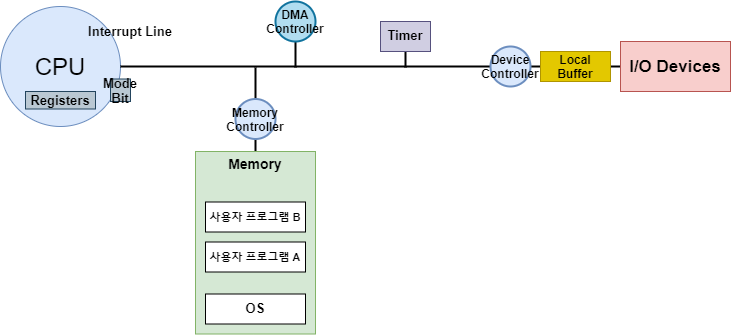

# Chapter2_System Structure & Program Execution

(개요) 컴퓨터 시스템의 구조와 관련해, 프로그램 수행에 Mode Bit, Timer 등이 어떻게 작동하는지 알아본다.

- Device Controller : I/O 장치를 전담하는 작은 CPU
  - (ex) 디스크 controller, 키보드 controller ... 

## Mode Bit

- 사용자 프로그램의 잘못된 수행으로 | 다른 프로그램 및 OS 에 피해가 가지 않도록 | 보호 장치가 필요하다. 
- Mode Bit 을 통해 | 하드웨어적으로 두 가지 모드의 Operation 을 지원한다. 
  - 1 : user mode - 사용자 프로그램 수행
  - 0 : **모니터 모드(커널 모드, 시스템 모드)**  - OS 코드 수행
    - OS는 CPU를 가지고 무슨 일이든 할 수 있다. 
- 보안을 해칠 수 있는 "중요한 명령어"는 | 모니터 모드에서만 수행 가능한 "특권명령"으로 규정된다.
- 동작과정
  - Interrupt / Exception 발생 시 : 하드웨어가 mode bit 을 0 으로 바꾼다.
  - 사용자 프로그램에 CPU 넘기기 전 : OS가 mode bit 을 1로 셋팅하고 넘겨준다. 
- Exception 예시
  만약... 사용자 프로그램에서 "위험한 기계어"를 실행하려 한다면?
  자동적으로 CPU가 운영체제한테 넘어간다.
- Interrupt
  - (주로) I/O 장치들이 발생시킨다. 
  - CPU는 매 순간 다음 라인 실행하기 앞서 | Interrupt 들어온 것이 있나 확인한다. 

## Registers (CPU 내부에 위치)

- CPU는 매 순간 <u>메모리에 있는 기계어</u>를 실행한다.
  - 메모리는 CPU의 작업공간이다.
  - Register 中 Program Counter(**PC**) 가 가리키는 위치의 기계어를 읽어와서 실행한다.
    - 다음번에 실행할 기계어의 <u>메모리 주소를 갖고 있다.</u>
    - 한줄을 실행하면? 그 다음 위치를 가리킨다.
      - OS(의 기계어)를 가리키거나... 사용자 프로그램(의 기계어)을 가리키거나...
- (CPU는 매 순간 기계어를 실행한 후 Interrupt 를 확인한다.) 
  - Interrupt가 들어왔을 때? 무조건 PC가 OS를 가리킨다. (H/W적 규칙)

## Timer

- (목적) CPU 독점을 막는 부가적인 하드웨어
  - 만약 사용자 프로그램A가 무한 루프를 돈다면? 
  - OS 스스로 A에서 CPU 사용권을 빼앗아올 수 없다;; 
- 정해진 시간 흐른 뒤
  OS에게 제어권이 넘어가도록 Interrupt를 발생시킨다.
  - OS가 A에 CPU를 넘길 때 timer 에 시간을 셋팅하고 넘긴다.
- 매 클럭 틱 때마다 1씩 감소한다. 
  - 타이머 값이 0이 되면, Timer Interrupt 가 발생한다.
- time sharing 구현 위해 널리 이용되고, 현재 시간 계산 용으로도 사용된다. 

(개요) 인터럽트가 운영체제를 구동시키는 원리와 인터럽트의 한 종류인 시스템콜에 대해 알아본다. 
동기식/비동기식 입출력에서의 인터럽트, DMA를 이용한 인터럽트 조절에 대해 알아본다. 
계층구조에 의해 I/O에서 입출력명령어가 다름을 이해한다.

## Interrupt

- Interrupt당한 시점의 register와 pc를 save한 후
- CPU 제어를 `인터럽트 처리 루틴` 에 넘긴다.

### Interrupt (넓은 의미) 분류

#### H/W Interrupt (좁은 의미)
- H/W (예: I/O 장치) 가 발생시킨 인터럽트

#### Trap (S/W Interrupt)
- Exception : 프로그램이 오류를 범했을 때
  - 프로그램이 권한 없는 기계어를 실행하려 할 때
  CPU가 Mode Bit를 체크한다.
- System Call : 사용자 프로그램이 OS의 서비스를 받기 위해 스스로 커널 함수를 호출하는 것 (자신의 코드를 통해 Interrupt를 건다.)
  - 사용자 프로그램은, 자신의 가상 메모리 공간을 가로질러 Program Counter를 강제로 바꿀 수 없기 때문에
  - I/O 장치 접근 기계어는 전부 특권 명령어이다. 따라서 사용자 프로그램이 CPU 를 사용 중인 상태에서 I/O 장치에 접근할 수는 없다. 따라서 특권 명령어를 실행할 수 있는 O/S 에게 대신 I/O 작업을 요청한다. 

### Interrupt 관련 용어
- Interrupt Vector : 해당 Interrupt 를 처리하는 루틴의 주소를 갖고 있음
- Interrupt 처리 루틴 (Service Routine) (= Interrupt Handler) : 해당 Interrupt 를 처리하는 Kernel 함수 

## System Call

- [정의] 사용자 프로그램이 운영체제의 서비스를 받기 위해
  커널 함수를 호출하는 것
  - 사용자 프로그램 스스로 운영체제를 부른다.
  - 사용자 프로그램 스스로 Interrupt 를 건다.
- 직접 Program Counter 를 넘길 수 없기 때문에
  S/W 자신의 기계어를 통해서 Interrupt Line 을 셋팅한다.
- CPU가 다음 기계어를 실행하기 전에 Interrupt가 왔으니 > CPU가 OS로 넘어간다.

## Device Controller
### I/O Device Controller
- 해당 I/O 장치 유형을 관리하는, 일종의 작은 CPU 
- 제어정보를 위해 control register 와 status register를 가진다.
- (일종의 data register인) local buffer를 가진다. 

### I/O 작업

- I/O는 device 와 local buffer 사이에서 일어난다. 
- I/O 종료 시 device controller 는 interrupt 로 CPU 에게 알린다. 

### c.f. 

- Device Driver (S/W)
  - OS 코드 中 각 장치별 처리루틴
- Device Controller (H/W)
  - 각 장치를 통제하는 일종의 작은 CPU

## 동기식 입출력, 비동기식 입출력

* 두 경우 모두 I/O 완료는 Interrupt 로 CPU에 알려준다. 

### Synchronous I/O

- I/O 요청 후 I/O 작업이 완료된 후에야
  제어가 사용자 프로그램으로 넘어간다.
- 구현방법1
  - I/O가 끝날때까지 CPU를 낭비한다.
  - 매 시점 하나의 I/O이 일어난다.
- 구현방법2
  - I/O 가 완료될 때까지 해당 프로그램에서 CPU를 빼았는다.
  - I/O 를 기다리는 중에, 해당 프로그램을 줄세우고... 다른 프로그램에게 CPU를 준다. 

### Asynchrounous I/O

- I/O가 시작된 후 입출력 작업이 끝나기를 기다리지 않고
- 제어가 사용자 프로그램에게 즉시 넘어간다.

## DMA(Direct Memory Access)

- (목적) 고속 I/O 장치를 (메모리에 가까운 속도로) 처리하기 위해 사용한다. 
  - 너무 많은 Interrupt 를 막기 위해 (비효율적)
  - DMA Controller 가 Local Buffer Block 내용을 직접 Memory 에 올려놓고 (전송하고) CPU에 Interrupt 걸어서 알려준다. 
- CPU 중재 없이 DMA 가 Device 의 Buffer Storage 내용을 <u>Memory 에</u> **Block 단위**로 <u>직접 전송</u>한다.
  - Memory 는 CPU의 작업공간으로... 원칙적으로 CPU만 접근 가능하다.  

  - Byte 단위가 아니라 <u>Block 단위로</u> Interrupt를 발생시킨다.(CPU에게 알려준다.)

## 서로 다른 I/O 기계어

1. I/O를 전담하는 special instruction 에 의해
   - Memory 접근 기계어가 따로 있고
   - I/O 수행 기계어가 따로 있다. 
2. Memory Mapped I/O에 의해 
   - Memory 주소를 연장해서 매겨놓는다.
   - Memory 접근하는 기계어를 통해 I/O에 접근한다. 

## 저장장치 계층 구조

- Caching : copying Info into faster storage system

- Primary vs. Secondary
  - Speed ↑
  - Cost ↑
  - Volatility ↑
- Primary 는 CPU가 직접 접근 가능하다. = Executable
- Secondary 는 I/O 가 필요하다. 
