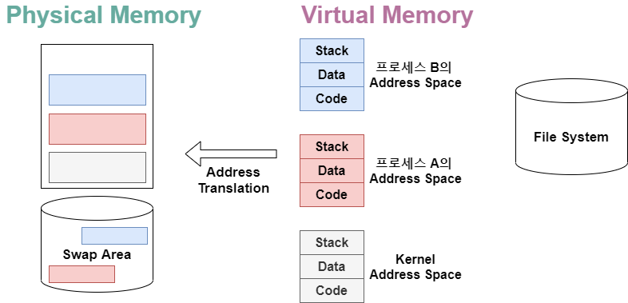

# Chapter3 _ Process

## 프로그램의 실행 (메모리 load)

### 가상 메모리

- 각각의 프로그램은 메모리에 각자의 주소 공간이 있다.

  - 0 번지부터 시작하는
  - ps마다 주소가 매겨진다.

- 당장 필요한 부분? 피지컬 메모리에 올라간다.

- 그렇지 않은 부분? 디스크의swap area 에 내려가 있다.

### Physical Memory

- 0부터 시작, 쭉 주소가 매겨진다.
  - OS 는 낮은 주소에 올라간다.

### 주소변환

- 가상 메모리와 피지컬 메모리는 다른 주소다. 
  - 그래서 주소변환이 필요하다.

---

## 프로세스 각각의 주소 공간의 구성요소

### Code

- 컴파일된 기계어 코드가 위치한다.

### Data

- 전역변수나 프로그램이 시작~종료할 때까지 남아 있는 데이터들이 위치한다. 
- 메모리 데이터를 쓸 때... 
  - 예) 배열, 변수 잡아 쓸 때... 
- 모든 데이터가 위치하는 건 아니다. 
  - 함수 안의 지역변수는 스택에 위치한다.

### Stack

* 언어 무관 모든 프로그램이 함수로 되어 있다. 

- 함수 호출하면 리턴되어 되돌아와야 하는데... 
  리턴 관련 정보를 차곡 쌓아놨다가...
  - 리턴 시에 내용을 읽어서 되돌아간다. 

## 커널 주소 공간의 내용 

- Kernel 도 하나의 프로그램이다. => 함수 구조로 되어 있다.

- 커널의 주소 공간도 code, data, stack 으로 구성되어 있다.

### 운영체제 - 코드

- 시스템콜, 인터럽트 처리 코드
- 자원 관리를 위한 코드
- 편리한 서비스 제공을 위한 코드

### 운영체제 - 데이터

- 모든 하드웨어 관리 위한 자료구조 갖고 있다. 
- 모든 ps 들 관리 위한 자료구조 갖고 있다. `PCB` 

### 운영체제 - 스택

- 커널 스택은, 프로세스마다 별도 공간을 두고 있다.
- 커널 함수(code부)와 관련된 스택이긴 한데... 
  (os도 함수 구조로 되어있을 거자나)
  - 다만 이 커널 함수가... 누구(어느 프로세스) 때문에 호출되었느냐? 에 따라... 공간이 나뉘어 있다.

## 사용자 프로그램이 실행하는 함수

- 라이브러리  함수 : 사용자 정의 함수든... 내 프로그램 안에 코드가 들어간다. 
(누가 만들었건)

-  반면!!! 커널 함수는 커널에 코드가 들어가 있다.
- 커널 함수를 호출하는 것을... => 시스템 콜이다. 라고 부른다. 
  - 사용자 프로그램이 운영체제의 서비스를 받기 위해 / 
    커널 함수를 호출하는 것 !!! 

<u>**@2. 프로세스의 개념, 상태, 문맥과 운영체제가 프로세스를 큐에 넣고 관리하는 형태에 대해 알아본다.**</u>

chapter3_process

## 프로세스의 개념

- Process is a program in execution
- 프로세스의 문맥 ( Context )
  - CPU 수행 상태를 나타내는 하드웨어 문맥
  - 시간에 따라 바뀐다. 

ㅇ 운영체제 : 자신의 data 영역에 ps마다 pcb를 두고 있다.
각 프로세스마다 pcb를 가지고 있다. 
pcb 에 프로세스의 각종 정보 갖고 있다. 이걸 봐야... 그 ps 의 문맥 알 수 있을 것...
ㅇ 프로세스의 상태를 관리한다
ㅇ 넘어갈 때... pc나 레지스터 값을 저장을 해놔야... 담에 cpu 얻었을 때, 그 문맥 바로 다음을 실행할 수 있음. 

=> 이것들이 모여서 프로세스의 문맥이다! 

ㅇ 큐를 사용해서 줄 세워놓고 처리한다. 

@ 스케줄러의 세 종류인 장기, 단기, 중기 스케줄러에 대해 알아본다.

## 프로세스의 상태

- <그림> 에서 admit 을 해주는 것이 장기 스케줄러.
  - 메모리에 들어오도록 허락해주는 것이 장기 스케줄러의 역할 
  - time sharing system (우리가 다루는 일반적인 운영체제) : 보통 장기 스케줄러가 없다. 
    - 실행되면 곧바로 ready 상태에 들어간다.
  - deg. of multiprogramming : 메모리에 몇 개 올라가 있는지 
- 그 대신 메모리 관리를 어떻게 하느냐? 
  - 중기 스케줄러를 둔다.
    - 프로세스를 통째로 메모리에서 디스크로 쫒아냄
    - suspended 라는 프로세스 상태가 추가된다.
      - 메모리에서 쫒겨난 상태. 
      - 몇가지 stopped 되는 원인이 있다. 
        - 공통점 : 항상 외부적인 이유이다. 
        - ex. 운영체제가 (프로세스 입장에선 외부다.)
        - ex. 사람이 갑자기 정지시킬 수 있다. 리눅스 ctrl+z 눌렀을 때 
- suspend 는 CPU 실행이든 I/O 든 아무일도 못하는 중
- suspended 상태에서 위로 올라가는 것? 
  - 본인 스스로 할 수 없다. (vs. 블럭드? I/O 다하면 interrupt 해서 돌아갈 수 있다. )
  - 사람이 sus 했으면 사람이 재개해줘야 하고...
  - 운영체제가 했으면 운영체제가 위로 올려줘야 한다.

@ 프로세스의 상태 변화와 프로세스 중 CPU 수행 단위인 스레드에 대해 알아본다.

